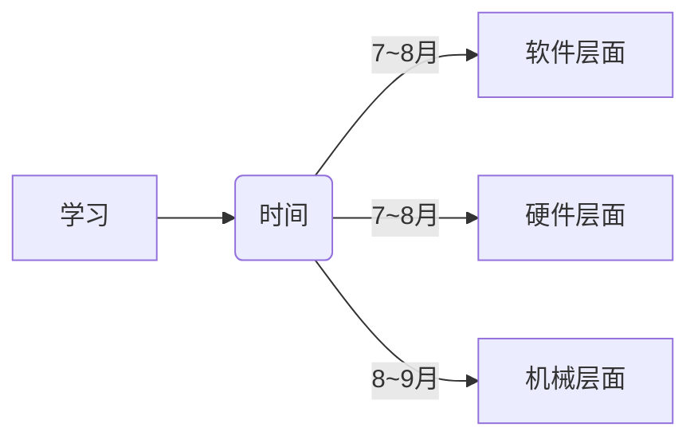

# markdown 语法小笔记

## Author：Vast_Lance

### 0.入门基础知识：

#### 换行：行末加 两个空格 或 `<br>`

#### 列表：
“-” 减号 或 “+” 加号 或 “*” 星号 都可以表示无序列表（记得加空格）。  
如下所示：
- 内容一 
- 内容二
+ 内容三
+ 内容四
* 内容五
* 内容六

#### 无序标题：
- `#`:一级标题
- `##`:二级标题
- ...
- `######`:六级标题

#### 有序标题：
用数字加“.”表示有序标题。如下所示：
1. 内容一
2. 内容二
3. 内容三

#### 标题的层级关系：
空格数决定标题的层级关系。如下所示：
- 一级标题
    - 二级标题
        - 三级标题
            - 四级标题
                - 五级标题
                    - 六级标题

#### 斜体和加粗：
- 斜体：两边各加一个 “*” 或 “ _ ”
  - 如：*斜体* 或 _斜体_ 
- 加粗：两边各加两个 “*” 或 “_”
  - 如：**加粗** 或 __加粗__ 
- 斜体加加粗：两边各加三个 “*” 或 “_”
  - 如：***斜体加粗*** 或 ___斜体加粗___ 

### 1.试试代码和代码块：  
`print(1)`

```python
def hello():
    print('Hello world!')
    print('Hello Vast Lance!')
```

___

### 2.试试水平分隔线：
- \---  
- \***
- \___(下划线)

***

### 3.试试引用：
> 世上无难事，只要肯登攀🌕  
> 爱自己是终身浪漫的开始🌹  

引用嵌套：
> 著名计算机科学家 Tim Peters 的 Python 之禅：
> > 优美胜于丑陋  
> > 明了胜于晦涩  
> > 简单胜于复杂  

---

### 4.试试表格：  
| left | middle |  right |  
|:-----|:------:|-------:|
| 左对齐  |  居中对齐  |    右对齐 |
| 1    |   2    |      3 |  

---

### 5.试试脚注
海阔凭鱼跃，天高任鸟飞。[^1]  

[^1]:../practise/hi.txt

---  

### 6.定义列表

术语一
: 定义一  

术语二
: 定义二  

---  

### 7.数学公式
行内公式：$E=mc^2$  
块级公式：
$$
\sum_{i=1}^n i = \frac{n(n+1)}{2}
$$

---  

### 8.链接
<https://www.baidu.com>  
[谷歌](https://www.google.com)  
参考式链接：  
[百度][1]  
[谷歌][2]  

[1]:https://www.baidu.com  
[2]:https://www.google.com  

---

### 9.图片
**过拟合的解决办法：**  


---

### 10.锚点链接（页面内跳转）
点击即可跳转：  
[0.入门基础知识](#0入门基础知识)  
[1.试试代码和代码块](#1试试代码和代码块-)  
[2.试试水平分隔线](#2试试水平分隔线)

---

## Congratulations!⭐